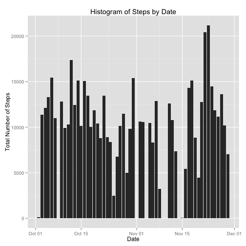
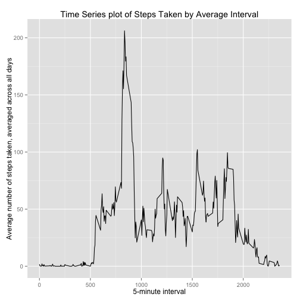
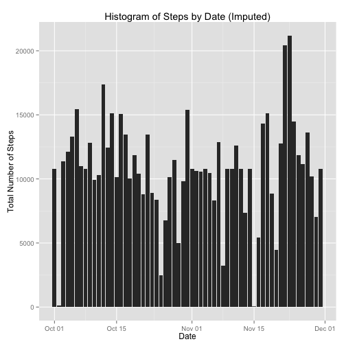
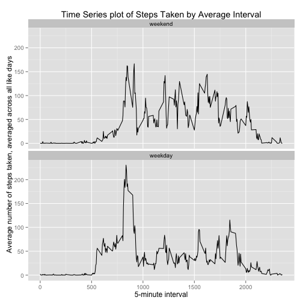

# Reproducible Research: Peer Assessment 1


## Loading and preprocessing the data

This data set is downloaded originally from [here](https://d396qusza40orc.cloudfront.net/repdata%2Fdata%2Factivity.zip). Kindly provided by our instructors. I have downloaded it and added it
to the repository already unzipped. This script works under the assumptions

* the working directory is set to the directory containing this script
* the directory contains a file called activity.csv
* the R installation has the ggplot2 library

First we load the required libraries for this analysis and set some global 
options to make our output a little neater:


```r
library(ggplot2)

## numbers >= 10^5 will be denoted in scientific notation, and rounded to 2
## digits

options(scipen = 1, digits = 2)
```


Then we import the data from the working directory using standard R. Since we
know that the data is in a 3 column format, and we know the data types, we can
specify the colClasses directly in the read.csv call.


```r
activity <- read.csv("~/play/RepData_PeerAssessment1/activity.csv", colClasses = c("numeric", 
    "Date", "numeric"))
```


## What is mean total number of steps taken per day?

First let's do some exploring, to visualize general evenness of the data
collection, let's aggregate by date the total number of steps taken and
show a histogram.


```r
steps_by_date <- aggregate(steps ~ date, activity, sum)
ggplot(steps_by_date, aes(x = date, y = steps)) + geom_histogram(stat = "identity") + 
    ylab("Total Number of Steps") + xlab("Date") + ggtitle("Histogram of Steps by Date")
```

 


There is nothing immediately alarming about this histogram. There are some data
missing and some visible high and low peaks, but overall the data looks sane.

Let's calculate a few descriptive statistics on this data set:


```r
mean_steps <- mean(steps_by_date$steps)
median_steps <- median(steps_by_date$steps)
```


For this data set, the mean number of steps taken per day is 10766.19 and
the median is 10765.

## What is the average daily activity pattern?

The next exploratory step is to analyze the signal data (the steps) across the
time domain. We can do this by providing a simple time series (line) plot of
the data at 5-minute intervals. We are going to average the 5 minute intervals
across all days to try to smooth out daily variations and find better patterns.


```r
steps_by_interval <- aggregate(steps ~ interval, activity, mean)
ggplot(steps_by_interval, aes(x = interval, y = steps)) + geom_line() + xlab("5-minute interval") + 
    ylab("Average number of steps taken, averaged across all days") + ggtitle("Time Series plot of Steps Taken by Average Interval")
```

 


There is clearly a spike visible, let's extract the exact interval at which
this takes place:

```r
max_interval <- steps_by_interval[which.max(steps_by_interval$steps), ]$interval
```


The interval throughout the day which has the maximum number of steps is
interval number 835.

## Imputing missing values

Sadly in this data set (much like in all real world data sets), there is some
data missing. Just how much?


```r
missing_record_count <- sum(!complete.cases(activity))
```


There are 2304 records with an NA. This is 
13.11% of the data set. So it's a not
insignificant percentage of the total data set. Let's take a simple approach to 
impute the missing data. We will store this in a new data frame,
activity.imputed.

* Get the interval values for any non-complete cases
* Retrieve the mean values from our steps_by_interval data frame
* Replace the missing values from the retrieved data


```r
activity.imputed <- activity

interval_indices <- match(activity[!complete.cases(activity), ]$interval, steps_by_interval$interval)

mean_values <- steps_by_interval[interval_indices, ]$step

activity.imputed[!complete.cases(activity.imputed), c("steps")] <- mean_values
```


Let's go ahead and re-create the earlier exploratory analysis with this new data
set, and see if there are any visible differences.

Let's aggregate by date the total number of steps taken and show a histogram
with the newly imputed data.


```r
steps_by_date_imputed <- aggregate(steps ~ date, activity.imputed, sum)
ggplot(steps_by_date_imputed, aes(x = date, y = steps)) + geom_histogram(stat = "identity") + 
    ylab("Total Number of Steps") + xlab("Date") + ggtitle("Histogram of Steps by Date (Imputed)")
```

 


There is nothing immediately alarming about this histogram, the imputation seems
to have been reasonable. Overall the data looks sane and definitely more full.

Let's calculate a few descriptive statistics on this imputed data set:


```r
mean_steps_imputed <- mean(steps_by_date_imputed$steps)
median_steps_imputed <- median(steps_by_date_imputed$steps)
```


For this data set, the mean number of steps taken per day is 10766.19 
and the median is 10766.19. Due to the fact that the aggregate 
function has as it's default signature na.action=na.omit, and we replaced the
values with values calcuated from the mean, there has been no change to the
descriptive statistics.

## Are there differences in activity patterns between weekdays and weekends?

For this analysis, we will use the data set with the imputed values. First we
need to enhance the data frame to add a factor for weekdays vs weekends.


```r
weekend_days <- c("Saturday", "Sunday")
is_weekend <- weekdays(activity.imputed$date) %in% weekend_days
activity.imputed$day_type <- factor(ifelse(is_weekend, "weekend", "weekday"))
```


Next, let's generate a time series plot like we did above. We will analyze the 
signal data (the steps) across the time domain. We can do this by providing a 
simple time series (line) plot of the data at 5-minute intervals grouped by our
new factor, day_type. 

We are going to average the 5 minute intervals across all days in each factor 
class to try to smooth out daily variations and find better patterns.


```r
# aggregate steps for weekdays
steps_by_interval_weekday <- aggregate(steps ~ interval, subset(activity.imputed, 
    day_type == "weekday"), mean)

# aggregate steps for weekends
steps_by_interval_weekend <- aggregate(steps ~ interval, subset(activity.imputed, 
    day_type == "weekend"), mean)

# set appropriate factor for each data
steps_by_interval_weekday$day_type <- "weekday"
steps_by_interval_weekend$day_type <- "weekend"

# combine weekends and weekdays into a single data frame
steps_by_interval_combined <- rbind(steps_by_interval_weekday, steps_by_interval_weekend)

# convert character to a factor, setting explicit order so the ggplot
# command will set weekends above weekdays as per diagram in assingment
# description
steps_by_interval_combined$day_type <- factor(steps_by_interval_combined$day_type, 
    levels = c("weekend", "weekday"))

ggplot(steps_by_interval_combined, aes(x = interval, y = steps)) + geom_line() + 
    xlab("5-minute interval") + ylab("Average number of steps taken, averaged across all like days") + 
    ggtitle("Time Series plot of Steps Taken by Average Interval") + facet_wrap(~day_type, 
    ncol = 1)
```

 

